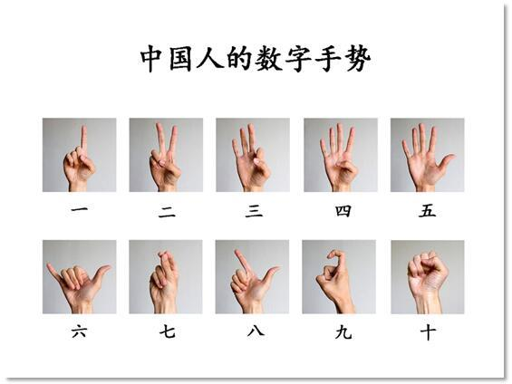

# gesture-finger-counter

gesture-finger-counter using Hand Tracking and Gesture Recognition

| Package       | Version |
| :------------ | ------- |
| python        | 3.11.3  |
| opencv-python | 4.8.1   |
| mediapipe     | 0.10.8  |

### Python VENV 

```
# For Linux OS
# Install venv
manjaro: 
sudo pacman -Sy && sudo pacman -S python-virtualenv
ubuntu: 
sudo apt-get update && sudo apt install python-virtualenv

# Version
virtualenv --version

# Set venv in the project
python -m venv venv

# Start venv
source venv/bin/activate 

# Quit venv
deactivate
```

### Package

```
pip install opencv-python
pip install mediapipe
```

### Hand Landmark Model


### Chinese Number Gesture




### Refer To

[Mediapipe](https://developers.google.com/mediapipe/solutions/vision/gesture_recognizer#get_started)
